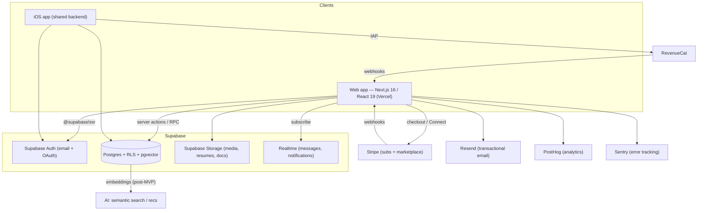

# PRD — Motiion

> Generated by the Product Planner skill from docs/VISION.md and docs/product-vision.md.
> Technical blueprint for AI coding agents. Visual design tokens are NOT defined here —
> they live in docs/design.md (dark-first, Geist + Geist Mono, teal accent). Reference that file for all styling.

## 1. Overview

### Product Summary

Motiion is the operating system for the professional dance industry — where dancers manage their careers and industry pros discover, hire, and organize talent. It is a Next.js web application sharing one Supabase backend and database with the Motiion iOS app, exposing the right functionality per user type over a single source of truth. Talent get a full desktop companion to the mobile app (profile, media, credits, availability, opportunities, messaging); industry professionals get an end-to-end talent operating system built around **Projects** (search a verified talent database, save rosters, create castings, invite talent, and run productions).

### Objective

This PRD covers the **MVP** as scoped in `docs/product-vision.md § Product Strategy` — the narrow, two-sided slice that makes the magic moment fire and proves the core loop. In scope: auth + user types, talent profiles, the verified talent database + structured search, rosters/talent lists, Projects with castings, opportunity matching for talent, invitations + RSVP, project-scoped messaging, and notifications — all on the shared Supabase backend. Explicitly out of scope for MVP (see § 13): full marketplace payments/take-rate, curated ad placements, AI/semantic search, deep multi-org permissions, and additional creative verticals.

### Market Differentiation

Motiion must be *professional creative software for dance*, not a casting marketplace. Technically that means three things the implementation has to nail: (1) a **verified, dance-native talent database** with fast, structured search over dance-specific attributes (style, look, availability, credits, union status); (2) a **Projects-centric data model** where every casting, invitation, message, and activity is a child of a Project — no orphaned workflows; and (3) **speed and motion as features** — sub-second search, keyboard-first navigation, and considered motion (via Motion + Lenis) that signals Linear/Figma-caliber craft. If search is slow or the app feels like a job board, the differentiation fails.

### Magic Moment

Two-sided, and both must be reachable in the MVP:

- **Talent:** On completing their profile, the dancer instantly sees live castings/opportunities matched to their skills, look, and availability. **What must work perfectly:** matching returns a non-empty, relevant result set the instant onboarding finishes (requires seeded opportunity supply and correct structured matching). **What must be fast:** profile completion → matched view in one sitting.
- **Industry:** A caster types a query and gets a verified, bookable roster in seconds, then drags talent into a Project. **What must be fast:** search results < ~1.5s. **What must be seamless:** search result → save to roster → invite into a Project with no context loss. (Plain-language/NL search is a post-MVP enhancement; structured search delivers the moment in v1.)

### Success Criteria

- Time from talent sign-up to matched-opportunities view (magic moment) < 5 minutes; matched view is non-empty given seeded supply.
- Structured talent search returns results in < 1.5s (p95) for the LA dataset.
- An industry user can go search → roster → Project → casting → invite in < 3 minutes.
- All P0 functional requirements implemented and verified; web + iOS operate on the same Supabase schema with no per-platform data forks.
- Core pages meet the Non-Functional thresholds in § 7 (LCP < 2.5s, WCAG 2.1 AA on primary flows).

## 2. Technical Architecture

### Architecture Overview



### Chosen Stack

| Layer | Choice | Rationale |
|---|---|---|
| Frontend | Next.js 16 (App Router) + React 19, Tailwind CSS 4, Motion + Lenis | Already in repo; best AI-tooling support; Motion/Lenis deliver the premium, animation-forward feel. Tailwind theme is wired from `docs/design.md` tokens (Geist + Geist Mono, dark-first, teal accent) |
| Backend | Supabase | Single shared backend for web + iOS; Postgres, Auth, Storage, Realtime in one platform |
| Database | Supabase Postgres (+ pgvector for post-MVP semantic search) | Relational fit for the core entity model; RLS enforces per-user/org access |
| Auth | Supabase Auth (email + OAuth, `@supabase/ssr`) | Native to backend; login/signup/OAuth callback already scaffolded; supports org/team model |
| Payments | Stripe (Connect + Billing) on web; RevenueCat for iOS IAP | Connect powers marketplace take-rate/payouts; Billing handles industry subscriptions; RevenueCat abstracts Apple billing |
| Analytics | PostHog | Product analytics, funnels, session replay, flags; analytics events model already defined in repo |
| Email | Resend | Transactional + notification email; clean fit with Next.js; Supabase Auth handles auth emails |
| Error tracking | Sentry | Catch client + server errors in production before users report them |

### Stack Integration Guide

**Setup order:** (1) Supabase project + schema + RLS policies; (2) `@supabase/ssr` server/client/middleware helpers (already present in `src/lib/supabase/`); (3) Auth flows + `auth/callback` route; (4) base app layout + design tokens from `docs/design.md`; (5) Sentry init (client + server) so crashes are caught from day one; (6) feature work; (7) Resend for notification emails; (8) Stripe + RevenueCat webhooks; (9) PostHog instrumentation.

**Known patterns:**
- Use the three Supabase clients already established: `src/lib/supabase/server.ts` (server components/actions), `client.ts` (browser), `admin.ts` (service-role, server-only — never import in client code).
- Prefer **Server Actions** and server components for reads/writes; use Supabase **Realtime** channels for messages and notifications only.
- Enforce access with **Row-Level Security** in Postgres, not just app checks. Every table with user/org data needs RLS policies.
- Keep one canonical data model; web and iOS read the same tables. Never fork a table to serve a single surface.

**Common gotchas:** service-role key must stay server-only; RLS must be enabled before exposing tables to the anon key; Supabase Storage buckets need explicit policies; Stripe/RevenueCat webhooks must verify signatures; Next.js 16 App Router requires `await`-ing dynamic APIs (`cookies()`, `headers()`, `params`).

**Required environment variables:** `NEXT_PUBLIC_SUPABASE_URL`, `NEXT_PUBLIC_SUPABASE_ANON_KEY`, `SUPABASE_SERVICE_ROLE_KEY`, `NEXT_PUBLIC_SITE_URL`, `STRIPE_SECRET_KEY`, `STRIPE_WEBHOOK_SECRET`, `NEXT_PUBLIC_STRIPE_PUBLISHABLE_KEY`, `REVENUECAT_WEBHOOK_SECRET`, `RESEND_API_KEY`, `NEXT_PUBLIC_POSTHOG_KEY`, `NEXT_PUBLIC_POSTHOG_HOST`, `SENTRY_DSN`, `SENTRY_AUTH_TOKEN`.

### Repository Structure

```
motiion-app-website/
├── src/
│   ├── app/                      # Next.js App Router
│   │   ├── (app)/                # Talent app surface (home, portfolio, discover)
│   │   ├── (buyer-app)/          # Industry/talent-buyer surface (dashboard, projects, talent, events)
│   │   ├── onboarding/           # Talent onboarding flow + actions
│   │   ├── talent-buyers/        # Buyer signup + onboarding
│   │   ├── auth/callback/        # Supabase OAuth callback route
│   │   ├── casting/[id]/         # Public casting pages
│   │   ├── profile/[slug]/       # Public talent profiles
│   │   ├── shortlist/[token]/    # Client shortlist review
│   │   ├── payments/             # Stripe success/cancel
│   │   └── api/                  # Route handlers (webhooks, etc.)
│   ├── components/
│   │   ├── app/                  # Talent app shell + views
│   │   ├── talent-buyers/        # Buyer dashboard, talent-navigator, casting composer
│   │   ├── onboarding/           # Onboarding editors (headshots, sizing, representation…)
│   │   ├── analytics/            # Analytics providers + dashboard charts
│   │   ├── auth/                 # Login/signup/OAuth UI
│   │   └── landing/              # Marketing site
│   ├── lib/
│   │   ├── supabase/             # server / client / admin / middleware / rpc / env
│   │   ├── auth/                 # profile, session, oauth helpers
│   │   ├── talent-navigator/     # search filters, rows, adapters
│   │   ├── talent-buyers/        # casting schema/payload, dashboard data
│   │   ├── search/               # profile search + filter logic
│   │   ├── analytics/            # events, tracking, kpi queries
│   │   └── onboarding/           # flow, resume parsing, drafts
│   └── types/                    # database.ts, casting.ts, talent-buyers.ts, search.ts …
├── docs/                         # VISION.md, product-vision.md, prd.md, product-roadmap.md, design.md
├── public/                       # Static assets, marketing imagery
└── package.json
```

### Infrastructure & Deployment

Deploy the web app to **Vercel** (native Next.js). **Supabase Cloud** hosts Postgres, Auth, Storage, and Realtime. Manage schema via Supabase **migrations** (`supabase/migrations/`) checked into the repo so web and iOS share versioned schema history. Set all env vars in Vercel project settings (Production + Preview). Stripe and RevenueCat webhooks target Vercel route handlers under `src/app/api/`. Use Vercel Preview Deployments per PR for the phase-review workflow.

### Security Considerations

- **Auth:** Supabase Auth with `@supabase/ssr`; session cookies refreshed in middleware. Protect app routes server-side (redirect unauthenticated users to `/login`).
- **Authorization:** Postgres **RLS** is the source of truth. Talent can read/write only their own profile; industry users access only Projects/rosters they own or are members of; public pages read only rows explicitly flagged public. Enforce org/team membership in policies.
- **Data protection:** Service-role key server-only. Signed URLs for private media in Storage. Validate all input with **Zod** at server-action boundaries (pattern already used in `casting-schema.ts`).
- **API security:** Verify Stripe/RevenueCat webhook signatures; rate-limit auth and public submission endpoints; never trust client-provided user/org IDs — derive from session.
- **Error tracking / PII:** Configure Sentry to scrub PII and secrets from events and breadcrumbs — error payloads must never leak tokens, emails, or personal data. Set `beforeSend` filters and deny-list sensitive keys.

### Cost Estimate

First 6 months at low scale (< 1,000 users):

| Service | Tier | Est. monthly | Free-tier limit |
|---|---|---|---|
| Vercel | Hobby → Pro | $0–20 | Hobby free; Pro $20 when custom domains/team needed |
| Supabase | Free → Pro | $0–25 | Free: 500MB DB, 1GB storage, 50k MAU; Pro $25 at scale |
| Stripe | Pay-as-you-go | ~2.9% + 30¢/txn | No monthly fee |
| RevenueCat | Free | $0 | Free < $2.5k MTR |
| PostHog | Free | $0 | 1M events/mo free |
| Resend | Free → $20 | $0–20 | 3,000 emails/mo free |
| Sentry | Developer | $0 | ~5k errors/mo free |
| **Total** | | **~$0–90/mo** | Mostly free at MVP scale |

-----

## 3. Data Model

Postgres tables with RLS. Field names use `snake_case`. This extends the schema already implied by `src/types/database.ts` (profiles, non_talent_profiles) and the casting composer.

### Entity Definitions

```sql
-- Organizations: agencies, production companies, creative teams
CREATE TABLE organizations (
  id UUID PRIMARY KEY DEFAULT gen_random_uuid(),
  name VARCHAR(255) NOT NULL,
  slug VARCHAR(255) UNIQUE NOT NULL,
  type VARCHAR(50) NOT NULL DEFAULT 'production_company', -- agency | production_company | brand | studio | other
  website TEXT,
  logo_url TEXT,
  created_by UUID NOT NULL REFERENCES auth.users(id),
  created_at TIMESTAMPTZ NOT NULL DEFAULT NOW()
);

-- Teams: sub-groups / workspaces within an organization
CREATE TABLE teams (
  id UUID PRIMARY KEY DEFAULT gen_random_uuid(),
  organization_id UUID NOT NULL REFERENCES organizations(id) ON DELETE CASCADE,
  name VARCHAR(255) NOT NULL,
  created_at TIMESTAMPTZ NOT NULL DEFAULT NOW()
);

-- Team membership + permission level
CREATE TABLE team_members (
  id UUID PRIMARY KEY DEFAULT gen_random_uuid(),
  team_id UUID NOT NULL REFERENCES teams(id) ON DELETE CASCADE,
  user_id UUID NOT NULL REFERENCES auth.users(id) ON DELETE CASCADE,
  role VARCHAR(50) NOT NULL DEFAULT 'member', -- owner | admin | member | viewer
  created_at TIMESTAMPTZ NOT NULL DEFAULT NOW(),
  UNIQUE (team_id, user_id)
);

-- Profiles: one row per auth user (mirrors src/types/database.ts ProfileRecord)
CREATE TABLE profiles (
  user_id UUID PRIMARY KEY REFERENCES auth.users(id) ON DELETE CASCADE,
  email VARCHAR(255),
  first_name VARCHAR(120),
  last_name VARCHAR(120),
  display_name VARCHAR(255),
  username VARCHAR(60) UNIQUE,
  account_type VARCHAR(30) NOT NULL DEFAULT 'talent', -- 'talent' | 'looking_for_talent'
  talent_types TEXT[],                                -- e.g. {dancer, choreographer}
  headshot_urls TEXT[],
  onboarding_completed_at TIMESTAMPTZ,
  created_at TIMESTAMPTZ NOT NULL DEFAULT NOW()
);

-- Non-talent (industry) profile extension
CREATE TABLE non_talent_profiles (
  id UUID PRIMARY KEY DEFAULT gen_random_uuid(),
  user_id UUID NOT NULL UNIQUE REFERENCES auth.users(id) ON DELETE CASCADE,
  organization_id UUID REFERENCES organizations(id),
  non_talent_type VARCHAR(50), -- casting_director | creative_director | producer | manager | agency | recruiter | other
  company_name VARCHAR(255),
  organization_name VARCHAR(255),
  organization_website TEXT,
  company_size VARCHAR(50),
  primary_goal VARCHAR(80),
  role VARCHAR(80),
  talent_types TEXT[],
  style_focus TEXT[],
  markets TEXT[],
  verification_links JSONB,
  notification_preferences JSONB,
  onboarding_completed BOOLEAN DEFAULT FALSE
);

-- Professional (talent) profile: the supply-side product + matching input
CREATE TABLE professional_profiles (
  id UUID PRIMARY KEY DEFAULT gen_random_uuid(),
  user_id UUID NOT NULL UNIQUE REFERENCES auth.users(id) ON DELETE CASCADE,
  slug VARCHAR(120) UNIQUE NOT NULL,
  subtype VARCHAR(30) NOT NULL DEFAULT 'dancer', -- dancer | choreographer
  bio TEXT,
  location_city VARCHAR(120),
  location_region VARCHAR(120),
  pronouns VARCHAR(40),
  gender VARCHAR(40),
  ethnicity TEXT[],
  height_cm INT,
  eye_color VARCHAR(40),
  hair_color VARCHAR(40),
  styles TEXT[],                 -- dance styles
  skills TEXT[],                 -- special skills
  union_status VARCHAR(40),      -- SAG | Eligible | Non-union
  availability VARCHAR(40),      -- available | limited | unavailable
  represented BOOLEAN DEFAULT FALSE,
  agency_name VARCHAR(255),
  social_links JSONB,            -- { instagram, tiktok, website, reel }
  is_verified BOOLEAN NOT NULL DEFAULT FALSE,
  verified_at TIMESTAMPTZ,
  search_vector TSVECTOR,        -- full-text search
  embedding VECTOR(1536),        -- pgvector, populated post-MVP
  updated_at TIMESTAMPTZ NOT NULL DEFAULT NOW(),
  created_at TIMESTAMPTZ NOT NULL DEFAULT NOW()
);

-- Media assets (headshots, reels, photos) attached to a professional profile
CREATE TABLE media_assets (
  id UUID PRIMARY KEY DEFAULT gen_random_uuid(),
  profile_id UUID NOT NULL REFERENCES professional_profiles(id) ON DELETE CASCADE,
  kind VARCHAR(30) NOT NULL, -- headshot | photo | reel | video
  storage_path TEXT NOT NULL,
  url TEXT,
  position INT NOT NULL DEFAULT 0,
  created_at TIMESTAMPTZ NOT NULL DEFAULT NOW()
);

-- Resume / credits
CREATE TABLE credits (
  id UUID PRIMARY KEY DEFAULT gen_random_uuid(),
  profile_id UUID NOT NULL REFERENCES professional_profiles(id) ON DELETE CASCADE,
  title VARCHAR(255) NOT NULL,
  role VARCHAR(255),
  company VARCHAR(255),      -- production / artist / brand
  category VARCHAR(80),      -- tour | tv_film | commercial | live | music_video
  year INT,
  position INT NOT NULL DEFAULT 0
);

-- Projects: the central organizational object for industry users
CREATE TABLE projects (
  id UUID PRIMARY KEY DEFAULT gen_random_uuid(),
  organization_id UUID REFERENCES organizations(id),
  owner_id UUID NOT NULL REFERENCES auth.users(id),
  title VARCHAR(255) NOT NULL,
  description TEXT,
  production_company VARCHAR(255),
  status VARCHAR(30) NOT NULL DEFAULT 'active', -- draft | active | completed | archived
  start_date DATE,
  end_date DATE,
  created_at TIMESTAMPTZ NOT NULL DEFAULT NOW()
);

-- Project members (team collaboration on a project)
CREATE TABLE project_members (
  id UUID PRIMARY KEY DEFAULT gen_random_uuid(),
  project_id UUID NOT NULL REFERENCES projects(id) ON DELETE CASCADE,
  user_id UUID NOT NULL REFERENCES auth.users(id) ON DELETE CASCADE,
  role VARCHAR(50) NOT NULL DEFAULT 'collaborator', -- owner | collaborator | viewer
  UNIQUE (project_id, user_id)
);

-- Castings: a hiring call within a project
CREATE TABLE castings (
  id UUID PRIMARY KEY DEFAULT gen_random_uuid(),
  project_id UUID NOT NULL REFERENCES projects(id) ON DELETE CASCADE,
  title VARCHAR(255) NOT NULL,
  description TEXT,
  visibility VARCHAR(20) NOT NULL DEFAULT 'public', -- public | unlisted | private
  password_hash TEXT,               -- for unlisted/private (see casting-password.ts)
  configuration JSONB NOT NULL DEFAULT '{}', -- mirrors castingConfigurationSchema
  submission_deadline TIMESTAMPTZ,
  status VARCHAR(30) NOT NULL DEFAULT 'open', -- draft | open | closed
  created_at TIMESTAMPTZ NOT NULL DEFAULT NOW()
);

-- Roles within a casting
CREATE TABLE casting_roles (
  id UUID PRIMARY KEY DEFAULT gen_random_uuid(),
  casting_id UUID NOT NULL REFERENCES castings(id) ON DELETE CASCADE,
  title VARCHAR(255) NOT NULL,
  description TEXT,
  age_min INT, age_max INT,
  gender VARCHAR(40),
  ethnicity_preferences TEXT[],
  special_skills TEXT[],
  height_min_cm INT, height_max_cm INT,
  union_status VARCHAR(40),
  people_needed INT NOT NULL DEFAULT 1,
  match_filters JSONB
);

-- Rosters / Talent Lists: saved collections of talent
CREATE TABLE talent_lists (
  id UUID PRIMARY KEY DEFAULT gen_random_uuid(),
  owner_id UUID NOT NULL REFERENCES auth.users(id) ON DELETE CASCADE,
  organization_id UUID REFERENCES organizations(id),
  name VARCHAR(255) NOT NULL,
  kind VARCHAR(30) NOT NULL DEFAULT 'roster', -- roster | favorites | collection
  created_at TIMESTAMPTZ NOT NULL DEFAULT NOW()
);

CREATE TABLE talent_list_members (
  id UUID PRIMARY KEY DEFAULT gen_random_uuid(),
  list_id UUID NOT NULL REFERENCES talent_lists(id) ON DELETE CASCADE,
  profile_id UUID NOT NULL REFERENCES professional_profiles(id) ON DELETE CASCADE,
  added_at TIMESTAMPTZ NOT NULL DEFAULT NOW(),
  UNIQUE (list_id, profile_id)
);

-- Saved searches
CREATE TABLE saved_searches (
  id UUID PRIMARY KEY DEFAULT gen_random_uuid(),
  owner_id UUID NOT NULL REFERENCES auth.users(id) ON DELETE CASCADE,
  label VARCHAR(255) NOT NULL,
  filters JSONB NOT NULL,
  created_at TIMESTAMPTZ NOT NULL DEFAULT NOW()
);

-- Invitations: bridge between industry & talent (castings, auditions, events)
CREATE TABLE invitations (
  id UUID PRIMARY KEY DEFAULT gen_random_uuid(),
  project_id UUID NOT NULL REFERENCES projects(id) ON DELETE CASCADE,
  casting_id UUID REFERENCES castings(id) ON DELETE CASCADE,
  activity_id UUID REFERENCES activities(id) ON DELETE CASCADE,
  invited_profile_id UUID NOT NULL REFERENCES professional_profiles(id) ON DELETE CASCADE,
  invited_by UUID NOT NULL REFERENCES auth.users(id),
  kind VARCHAR(30) NOT NULL DEFAULT 'casting', -- casting | audition | rehearsal | booking | event
  status VARCHAR(30) NOT NULL DEFAULT 'sent', -- sent | viewed | accepted | declined | confirmed
  message TEXT,
  responded_at TIMESTAMPTZ,
  created_at TIMESTAMPTZ NOT NULL DEFAULT NOW()
);

-- Activities: classes, sessions, auditions, castings, events (discovery + RSVP)
CREATE TABLE activities (
  id UUID PRIMARY KEY DEFAULT gen_random_uuid(),
  project_id UUID REFERENCES projects(id) ON DELETE CASCADE, -- null for standalone classes/events
  organizer_id UUID NOT NULL REFERENCES auth.users(id),
  kind VARCHAR(30) NOT NULL, -- class | session | audition | casting | event | rehearsal | fitting
  title VARCHAR(255) NOT NULL,
  description TEXT,
  location TEXT,
  starts_at TIMESTAMPTZ,
  ends_at TIMESTAMPTZ,
  price_cents INT,
  visibility VARCHAR(20) NOT NULL DEFAULT 'public',
  created_at TIMESTAMPTZ NOT NULL DEFAULT NOW()
);

CREATE TABLE activity_rsvps (
  id UUID PRIMARY KEY DEFAULT gen_random_uuid(),
  activity_id UUID NOT NULL REFERENCES activities(id) ON DELETE CASCADE,
  user_id UUID NOT NULL REFERENCES auth.users(id) ON DELETE CASCADE,
  status VARCHAR(30) NOT NULL DEFAULT 'going', -- going | interested | waitlist | cancelled
  created_at TIMESTAMPTZ NOT NULL DEFAULT NOW(),
  UNIQUE (activity_id, user_id)
);

-- Message threads (project-scoped) + messages
CREATE TABLE message_threads (
  id UUID PRIMARY KEY DEFAULT gen_random_uuid(),
  project_id UUID REFERENCES projects(id) ON DELETE CASCADE,
  casting_id UUID REFERENCES castings(id) ON DELETE CASCADE,
  created_at TIMESTAMPTZ NOT NULL DEFAULT NOW()
);

CREATE TABLE thread_participants (
  thread_id UUID NOT NULL REFERENCES message_threads(id) ON DELETE CASCADE,
  user_id UUID NOT NULL REFERENCES auth.users(id) ON DELETE CASCADE,
  PRIMARY KEY (thread_id, user_id)
);

CREATE TABLE messages (
  id UUID PRIMARY KEY DEFAULT gen_random_uuid(),
  thread_id UUID NOT NULL REFERENCES message_threads(id) ON DELETE CASCADE,
  sender_id UUID NOT NULL REFERENCES auth.users(id),
  body TEXT NOT NULL,
  created_at TIMESTAMPTZ NOT NULL DEFAULT NOW(),
  read_at TIMESTAMPTZ
);

-- Documents attached to a project
CREATE TABLE documents (
  id UUID PRIMARY KEY DEFAULT gen_random_uuid(),
  project_id UUID NOT NULL REFERENCES projects(id) ON DELETE CASCADE,
  uploaded_by UUID NOT NULL REFERENCES auth.users(id),
  title VARCHAR(255) NOT NULL,
  kind VARCHAR(40), -- call_sheet | contract | note | reference | other
  storage_path TEXT,
  created_at TIMESTAMPTZ NOT NULL DEFAULT NOW()
);

-- Notifications
CREATE TABLE notifications (
  id UUID PRIMARY KEY DEFAULT gen_random_uuid(),
  user_id UUID NOT NULL REFERENCES auth.users(id) ON DELETE CASCADE,
  kind VARCHAR(50) NOT NULL, -- invitation | message | match | rsvp | system
  title VARCHAR(255) NOT NULL,
  body TEXT,
  entity_type VARCHAR(50),
  entity_id UUID,
  read_at TIMESTAMPTZ,
  created_at TIMESTAMPTZ NOT NULL DEFAULT NOW()
);

-- Analytics events (mirrors src/lib/analytics/events.ts)
CREATE TABLE analytics_events (
  id UUID PRIMARY KEY DEFAULT gen_random_uuid(),
  user_id UUID REFERENCES auth.users(id) ON DELETE SET NULL,
  session_id UUID,
  name VARCHAR(80) NOT NULL,
  category VARCHAR(40) NOT NULL,
  properties JSONB,
  created_at TIMESTAMPTZ NOT NULL DEFAULT NOW()
);
```

> Note: `invitations` references `activities`; create `activities` before adding the FK, or add the FK in a follow-up migration.

### Relationships

- `auth.users` 1:1 `profiles`; `profiles` 1:1 `professional_profiles` (talent) OR 1:1 `non_talent_profiles` (industry), by `account_type`.
- `organizations` 1:many `teams`; `teams` many:many `auth.users` via `team_members`.
- `organizations` 1:many `projects`; `projects` many:many `auth.users` via `project_members`.
- `projects` 1:many `castings`; `castings` 1:many `casting_roles`.
- `projects`/`castings`/`activities` 1:many `invitations`; each invitation targets one `professional_profiles` row.
- `talent_lists` many:many `professional_profiles` via `talent_list_members`.
- `projects` 1:many `activities`, `documents`, `message_threads`; `message_threads` 1:many `messages`, many:many users via `thread_participants`.
- `professional_profiles` 1:many `media_assets`, `credits`.
- Cascade deletes flow from parent (org → team → members; project → castings → roles; profile → media/credits).

### Indexes

- `professional_profiles`: GIN on `search_vector` (full-text search); GIN on `styles`, `skills`, `ethnicity` (array containment filters); btree on `location_city`, `availability`, `union_status`, `is_verified`; ivfflat on `embedding` (post-MVP semantic search). These power the core industry magic moment (fast structured search).
- `invitations`: btree on `invited_profile_id`, `project_id`, `status` (talent inbox + project status views).
- `messages`: btree on `thread_id, created_at` (thread pagination).
- `notifications`: btree on `user_id, read_at, created_at` (unread badge + feed).
- `talent_list_members`: unique `(list_id, profile_id)`; index `profile_id`.
- `analytics_events`: btree on `name`, `created_at`, `user_id` (KPI/funnel queries).

-----

## 4. API Specification

### API Design Philosophy

Motiion is a Next.js App Router app on Supabase. The primary data-access pattern is **Server Actions** and **server components** calling Supabase directly (with RLS enforcing authorization), not a hand-rolled REST layer. Use **Route Handlers** (`src/app/api/**/route.ts`) only for: third-party webhooks (Stripe, RevenueCat), OAuth callback, and any public/unauthenticated read endpoints (public profiles, public castings). Realtime (messages, notifications) uses Supabase Realtime channels, not polling.

- **Auth for actions:** every server action derives the user from the Supabase session (`createServerClient`), never from client input. RLS is the second line of defense.
- **Validation:** all mutation inputs parsed with Zod (as in `casting-schema.ts`); return `{ ok: false, error }` shapes on failure.
- **Error format:** `{ ok: boolean, data?: T, error?: { code: string, message: string } }`.
- **Pagination:** keyset/cursor pagination (`created_at` + `id`) for messages, search results, and notifications; default page size 24 for search, 30 for messages.

Endpoints and actions by area (representative, not exhaustive — CRUD implied for each entity):

**Auth (Supabase + route handler)**
```
GET  /auth/callback            # exchange OAuth code → session (exists)
POST (server action) signUp    # email/password or OAuth; creates profiles row
POST (server action) selectAccountType  # 'talent' | 'looking_for_talent'
```

**Talent profile (server actions)**
```
upsertProfessionalProfile(input)   # bio, attributes, styles, skills, availability…
uploadMedia(file, kind)            # → Supabase Storage, returns media_assets row
reorderMedia(orderedIds[])
upsertCredits(credits[])
publishProfile()                   # sets slug, marks verify-eligible
```

**Public reads (route handlers / server components)**
```
GET /profile/[slug]                # public professional profile
GET /casting/[id]                  # public casting (respects visibility/password)
GET /activity/[id]                 # public activity/class/session/event
```

**Search & rosters (server actions)**
```
searchTalent(filters, cursor)      # structured filters → paged results (< 1.5s p95)
saveSearch(label, filters)
createTalentList(name, kind); addToList(listId, profileId); removeFromList(...)
```

**Projects, castings, invitations (server actions)**
```
createProject(input); updateProject(id, patch); listProjects()
createCasting(projectId, castingComposerForm)   # reuse castingComposerFormSchema
inviteTalent({ projectId, castingId?, activityId?, profileIds[], kind, message })
respondToInvitation(invitationId, 'accepted'|'declined')   # talent side
```

**Opportunities / matching (server actions)**
```
matchedOpportunities()             # for current talent: castings/activities matched by structured attributes
listInvitations(status?)           # talent inbox
```

**Activities & RSVP (server actions)**
```
createActivity(input); rsvpActivity(activityId, status)
listActivities(filters)            # discover classes/sessions/auditions/events
```

**Messaging (server actions + Realtime)**
```
getOrCreateThread({ projectId?, castingId?, participantIds[] })
sendMessage(threadId, body)
subscribe: realtime channel `messages:thread_id=eq.{id}`
```

**Notifications (server actions + Realtime)**
```
listNotifications(cursor); markRead(ids[])
subscribe: realtime channel `notifications:user_id=eq.{uid}`
```

**Webhooks (route handlers)**
```
POST /api/webhooks/stripe          # verify signature → update subscription/marketplace state
POST /api/webhooks/revenuecat      # verify → sync iOS entitlements
```

-----

## 5. User Stories

### Epic: Accounts & Onboarding

**US-001: Choose account type**
As a new user, I want to pick talent or industry so that I land in the right experience.
Acceptance Criteria:
- [ ] Given a new sign-up, when I choose an account type, then my `profiles.account_type` is set and I'm routed to the matching onboarding.
- [ ] Given I return before finishing, when I log in, then I resume onboarding at the correct step.
- [ ] Edge case: unknown/legacy account_type → routed to `/onboarding` to re-select.

**US-002: Build my talent profile**
As Maya (dancer), I want to build a complete profile in one sitting so that I'm bookable.
Acceptance Criteria:
- [ ] Given onboarding, when I add media, attributes, styles, skills, availability, and credits, then my profile saves incrementally (drafts) and shows completeness.
- [ ] Given I finish, when I publish, then I get a public `/profile/[slug]` and become verify-eligible.
- [ ] Edge case: leave mid-flow → draft is preserved and restored.

### Epic: Talent Magic Moment

**US-003: See matched opportunities**
As Maya, I want to instantly see opportunities matched to me so that the industry feels reachable.
Acceptance Criteria:
- [ ] Given I complete my profile, when I land on the opportunities view, then I see a non-empty, relevant list (given seeded supply) ranked by structured match.
- [ ] Given no matches, when the view loads, then I see a branded empty state prompting me to broaden availability/skills.

### Epic: Industry Search → Roster → Project

**US-004: Search verified talent**
As a caster, I want to filter the verified database so that I find the right dancers fast.
Acceptance Criteria:
- [ ] Given filters (style, location, availability, attributes, credits, union), when I search, then verified results return in < 1.5s.
- [ ] Given results, when I save a dancer, then they're added to a roster/list I can reuse.
- [ ] Edge case: no results → empty state with filter-relaxation suggestions.

**US-005: Create a Project and casting**
As a caster, I want to create a Project and post a casting so that hiring is organized.
Acceptance Criteria:
- [ ] Given I create a Project, when I add a casting (via the composer), then it's saved as a child of the Project.
- [ ] Given a roster, when I invite dancers into the casting, then each receives an invitation.

**US-006: Invite and track responses**
As a caster, I want to invite talent and see responses so that I can manage the production.
Acceptance Criteria:
- [ ] Given I invite dancers, when they RSVP/respond, then the Project shows live status per invitee.
- [ ] Edge case: invited dancer has no account yet → invitation is queued and delivered on sign-up (post-MVP: external invite email).

### Epic: Communication & Notifications

**US-007: Message within a Project**
As either side, I want project-scoped messaging so that communication stays with the job.
Acceptance Criteria:
- [ ] Given an invitation, when I open the thread, then messages are scoped to the Project/casting and update in real time.

**US-008: Get notified**
As any user, I want real-time notifications so that I don't miss invitations, messages, or matches.
Acceptance Criteria:
- [ ] Given new activity, when it occurs, then I see an in-app notification (and email for key events).

### Epic: Activities & Discovery

**US-009: Discover and RSVP**
As Maya, I want to discover classes/auditions/events and RSVP so that I stay active in the community.
Acceptance Criteria:
- [ ] Given the discover view, when I filter, then I see relevant activities; when I RSVP, then my status is recorded and the organizer sees it.

-----

## 6. Functional Requirements

**FR-001: Account type + routing**
Priority: P0
Description: On sign-up, capture `account_type` ('talent' | 'looking_for_talent') and route to the correct onboarding and app shell; enforce on every protected route.
Acceptance Criteria:
- account_type persisted on `profiles`; `getProfileDestination` logic (see `src/lib/auth/profile.ts`) governs redirects.
- Unauthenticated access to app routes redirects to `/login`.
Related Stories: US-001

**FR-002: Talent profile system**
Priority: P0
Description: Full talent profile CRUD — media upload/reorder (Supabase Storage), credits, representation, physical attributes, styles, skills, availability, location, social links — with incremental draft saves and a completeness indicator.
Acceptance Criteria:
- A dancer can build and publish a complete profile in one sitting; published profile is reachable at `/profile/[slug]`.
- Media stored in a private bucket with signed URLs; drafts restored on return.
Related Stories: US-002

**FR-003: Verified talent database + structured search**
Priority: P0
Description: Industry search over verified professional profiles with filters (keyword, style, location, representation, agency, gender, ethnicity, height, availability, union status, experience, subtype — mirrors `TalentNavigatorFilters`). Results paginated, verified-first.
Acceptance Criteria:
- Results in < 1.5s p95 on the LA dataset; only `is_verified` profiles shown by default (toggle for unverified where permitted).
- Uses GIN/btree indexes from § 3.
Related Stories: US-004

**FR-004: Rosters / talent lists + saved searches**
Priority: P0
Description: Save talent into named lists (roster/favorites/collection) and persist saved searches.
Acceptance Criteria:
- Add/remove talent to a list; reuse a list when inviting; save and re-run a search from filters.
Related Stories: US-004

**FR-005: Projects + castings**
Priority: P0
Description: Create/manage Projects; create castings within a Project using the existing casting composer schema (`castingComposerFormSchema`); castings have roles, visibility, and configuration.
Acceptance Criteria:
- Create Project → create casting → casting is a child of the Project; composer validation per `validateCastingStep`.
Related Stories: US-005

**FR-006: Opportunity matching for talent**
Priority: P0
Description: On profile completion, surface live castings/activities matched to the talent's structured attributes (style, location, availability, skills, union). Ranking by attribute overlap for MVP.
Acceptance Criteria:
- Completed profile shows a non-empty matched view given seeded supply; empty state otherwise.
Related Stories: US-003

**FR-007: Invitations + RSVP + status**
Priority: P0
Description: Invite talent from search/rosters into a casting/audition/event; talent respond; Project reflects live status.
Acceptance Criteria:
- Invitation lifecycle: sent → viewed → accepted/declined/confirmed; industry sees per-invitee status on the Project.
Related Stories: US-006

**FR-008: Project-scoped messaging**
Priority: P0
Description: Real-time threads scoped to a Project/casting with participants; messages persist and mark read.
Acceptance Criteria:
- Two sides exchange messages in a Project context; updates arrive via Realtime without refresh.
Related Stories: US-007

**FR-009: Notifications**
Priority: P0
Description: In-app real-time notifications for invitations, messages, matches, and RSVPs; email for key events (invitations, first message).
Acceptance Criteria:
- Unread badge; notification feed; Realtime delivery; email via Resend for key events.
Related Stories: US-008

**FR-010: Activities discovery + RSVP**
Priority: P1
Description: Browse/filter classes, sessions, auditions, castings, and events; RSVP with status.
Acceptance Criteria:
- Discover view with filters; RSVP recorded; organizer sees attendee list.
Related Stories: US-009

**FR-011: Shared backend parity (web + iOS)**
Priority: P0
Description: All features read/write the same Supabase schema; no per-platform table forks.
Acceptance Criteria:
- Schema changes are migrations in `supabase/migrations/`; web and iOS use identical tables.
Related Stories: (cross-cutting)

**FR-012: Basic org/team support**
Priority: P1
Description: Industry users belong to an organization; project members can collaborate.
Acceptance Criteria:
- Create org on buyer onboarding; add project members; RLS restricts access to members.
Related Stories: US-005, US-006

**FR-013: Verification workflow (lightweight)**
Priority: P1
Description: Admin-lightweight process to mark talent profiles verified.
Acceptance Criteria:
- `is_verified` togglable via admin; verified badge shown; search defaults to verified.
Related Stories: US-004

**FR-014: Industry subscription gating (Stripe)**
Priority: P1
Description: Gate advanced industry features (unlimited search/rosters/projects) behind a paid tier via Stripe Billing; talent remain free.
Acceptance Criteria:
- Checkout + webhook updates entitlement; gated features check subscription status.
Related Stories: (business model)

**FR-015: AI/semantic search & recommendations**
Priority: P2
Description: Natural-language filtering and embedding-based ranking over `professional_profiles.embedding`.
Acceptance Criteria:
- Post-MVP; structured search must ship first.
Related Stories: US-004

**FR-016: Marketplace (classes/events) + curated placements**
Priority: P2
Description: Stripe Connect take-rate on class/event bookings and curated paid placements.
Acceptance Criteria:
- Post-MVP; deferred until active industry accounts and a class/event partner exist.
Related Stories: (business model)

-----

## 7. Non-Functional Requirements

### Performance
- Largest Contentful Paint < 2.5s on mid-tier hardware / fast 4G; Time to Interactive < 3.5s.
- Structured talent search < 1.5s p95; matched-opportunities view < 1.5s.
- Server-action mutations < 300ms p95 (excluding file uploads).
- Initial route JS payload < 250KB gzipped; use RSC + streaming; lazy-load the casting composer and analytics dashboards.

### Security
- OWASP Top 10 addressed. Postgres RLS on every user/org table.
- Supabase session cookies; refresh in middleware; sensitive routes server-guarded.
- Webhook signature verification (Stripe, RevenueCat). Rate-limit auth and public submission endpoints.
- Sentry configured to scrub PII/secrets from events and breadcrumbs.

### Accessibility
- WCAG 2.1 AA on all primary flows (onboarding, search, project, messaging).
- Full keyboard navigation and visible focus states (keyboard-first is a product principle).
- Screen-reader labels on interactive controls; respects `prefers-reduced-motion` for Motion/Lenis animations.

### Scalability
- Support 1,000+ concurrent users on Supabase Pro + Vercel Pro without redesign.
- Search indexed to handle 10k+ verified profiles at target latency.
- Realtime channels scoped per-thread/per-user to bound fan-out.

### Reliability
- 99.5% uptime target (inherits Vercel + Supabase SLAs).
- Graceful degradation: if Realtime drops, fall back to on-focus refetch; if Resend fails, in-app notification still delivered; if Stripe webhook is delayed, entitlement reconciles on next check.

-----

## 8. UI/UX Requirements

> Visual tokens (colors, typography, spacing, component styling) live in `docs/design.md` (source of truth) and are rendered live in `docs/design.html`. This section covers structure, states, and interactions only — reference the token and component names below from `docs/design.md`. Key tokens: dark-first palette (`background #0A0A0A`, `surface`, `surface-raised`, hairline `border`), **white `primary`** as the main CTA color and **teal `accent` (`#2DD4BF`)** reserved for glows/verified badge/focus; typefaces **Geist** (display→caption) + **Geist Mono** (metadata labels, keyboard shortcuts); radius `md 8px` (buttons/inputs), `lg 14px` (cards), `full` (chips/badges); 4px spacing scale. Components referenced here map to design.md entries: `button-primary`/`-secondary`/`-ghost`/`-accent`, `input`, `chip`/`chip-active`, `badge-verified`/`badge-meta`, `card-talent`/`card-project`, `nav-tab`/`nav-tab-active`, `modal`, `kbd`.

### Screen: Talent Onboarding
Route: `/onboarding`
Purpose: Build a complete, publishable talent profile.
Layout: Multi-step flow (existing `onboarding-flow.tsx`) — stepper, main editor panel, live completeness indicator.
States:
- Empty: guided first step (account type already chosen).
- Loading: skeletons for media grid.
- Populated: filled fields with draft autosave.
- Error: inline field errors; toast on save failure with retry.
Key Interactions:
- Add media → upload to Storage → thumbnail appears, reorderable.
- Complete → publish → redirect to `/home` with matched opportunities.
Components Used: headshot upload grid, sizing editor, representation editor, resume upload (from `docs/design.md`).

### Screen: Talent Home / Opportunities (magic moment)
Route: `/home`
Purpose: Show matched opportunities immediately after profile completion.
Layout: Feed/grid of matched castings + activities; filter chips.
States: Empty (broaden availability prompt) / Loading (skeleton cards) / Populated (ranked matches) / Error (retry).
Key Interactions: open opportunity → view detail → apply/RSVP; matched list updates when profile/availability changes.

### Screen: Talent Navigator (industry search)
Route: `/talent` (buyer-app)
Purpose: Search + browse verified talent (magic moment, industry side).
Layout: Left filter rail, results grid, active-talent detail panel; keyboard shortcuts.
States: Empty (relax filters) / Loading (skeleton grid) / Populated (verified-first results) / Error.
Key Interactions: adjust filters → results update < 1.5s; save to roster; drag/add into a Project; save search.
Components Used: filter summary, style chips, talent card, keyboard-shortcuts hint (from `docs/design.md`).

### Screen: Project detail
Route: `/projects/[id]` (buyer-app)
Purpose: Run a production — castings, invited/confirmed talent, schedule, docs, messaging.
Layout: Project header + tabbed sections (Castings, Talent, Activities, Documents, Messages).
States: Empty (create first casting) / Loading / Populated / Error.
Key Interactions: create casting (composer) → invite from roster → track RSVP status → message invitee.

### Screen: Casting Composer
Route: `/projects/[id]/... ` or `/casting/new`
Purpose: Build a casting with roles, dates, compensation, submission config.
Layout: Stepped composer (basics → location → compensation → submission → roles → review) per `validateCastingStep`.
States: Draft autosave / validation errors per step / review summary.

### Screen: Buyer Dashboard
Route: `/dashboard` (buyer-app)
Purpose: Overview of projects, rosters, recent activity, events.
Layout: Hero + action cards + project table + activity feed.

### Screen: Messages / Inbox
Route: `/messages` (buyer) and inbox tab (talent)
Purpose: Project-scoped threads.
Layout: Thread list + conversation pane; real-time updates.
States: Empty / Loading / Populated / Error (send-failure retry).

### Screen: Public Profile
Route: `/profile/[slug]`
Purpose: Public, shareable talent profile.
States: Populated / Not found (`not-found.tsx`).

### Modals/Dialogs: sign-up-required, session sign-up, share sheet, verification badge — reuse existing modal components; consistent motion.

-----

## 9. Auth Implementation

### Auth Flow
Supabase Auth via `@supabase/ssr`. Email/password + OAuth (Google via `GoogleLogo`/`oauth-buttons.tsx`). Sign-up creates an `auth.users` row + trigger/insert into `profiles`; user selects `account_type`; routed to onboarding. OAuth returns to `/auth/callback` (existing route) which exchanges the code for a session.

### Provider Configuration
- Configure Supabase Auth providers (email, Google) in the Supabase dashboard; set redirect URLs to `${NEXT_PUBLIC_SITE_URL}/auth/callback`.
- Use `createServerClient` (from `src/lib/supabase/server.ts`) in server components/actions; `createBrowserClient` (`client.ts`) in client components; `admin.ts` (service role) only in trusted server code.
- Refresh sessions in `middleware.ts` (already present) on every request.

### Protected Routes
- App route groups `(app)` and `(buyer-app)` require a session; unauthenticated → `/login`.
- Route by `account_type` using `getProfileDestination`/`getOnboardingPath` (`src/lib/auth/profile.ts`).

### User Session Management
- Session in HTTP-only cookies managed by `@supabase/ssr`; access user via `supabase.auth.getUser()` server-side (never trust client claims).

### Role-Based Access
- App-level: talent vs industry via `account_type`.
- Org-level: `team_members.role` and `project_members.role` (owner/admin/member/viewer).
- Enforced primarily by Postgres RLS; UI hides actions the user can't perform.

-----

## 10. Payment Integration

### Payment Flow
Two rails: **Stripe** on web (industry subscriptions now; marketplace take-rate on classes/events post-MVP) and **RevenueCat** for iOS in-app subscriptions. Web checkout uses Stripe Billing Checkout Sessions; entitlement synced via webhook to a `subscriptions` table (add in the payments phase).

### Provider Setup
- Stripe: create Products/Prices for industry tiers; enable Stripe **Connect** (Express accounts) for future class/event payouts. Store `STRIPE_SECRET_KEY`, `STRIPE_WEBHOOK_SECRET`, publishable key.
- RevenueCat: configure iOS entitlements mapping to the same subscription state; `REVENUECAT_WEBHOOK_SECRET`.

### Pricing Model Implementation
- Talent: free (no payment path).
- Industry: paid tier(s) gating advanced search/rosters/projects (FR-014). Check entitlement server-side before gated actions.
- Post-MVP: marketplace take-rate on class/event bookings via Connect; curated placements billed via Stripe.

### Webhook Handling
- `POST /api/webhooks/stripe`: verify signature; handle `checkout.session.completed`, `customer.subscription.updated/deleted`, `invoice.paid`; update entitlement + emit `subscription_started/renewed/canceled` analytics events.
- `POST /api/webhooks/revenuecat`: verify; sync iOS entitlement to the same subscription state.

### Subscription Management
- Stripe Billing Customer Portal for self-serve management (link from buyer settings).
- Gate features by reading current entitlement; degrade gracefully if webhook lags (reconcile on next check).
- Test with Stripe test mode + RevenueCat sandbox before go-live.

-----

## 11. Edge Cases & Error Handling

### Feature: Auth & Session
| Scenario | Expected Behavior | Priority |
|---|---|---|
| Session expires mid-action | Silent refresh via middleware; if refresh fails, redirect to `/login` preserving return URL | P0 |
| OAuth callback error | Show friendly error on `/login`, allow retry | P0 |
| Legacy/unknown account_type | Route to `/onboarding` to re-select | P1 |

### Feature: Talent Profile & Media
| Scenario | Expected Behavior | Priority |
|---|---|---|
| Media upload fails | Toast + inline retry; keep other fields saved | P0 |
| Large/invalid file | Reject client-side with clear limit message | P1 |
| Abandon onboarding | Draft preserved; resume on return | P0 |

### Feature: Search
| Scenario | Expected Behavior | Priority |
|---|---|---|
| No results | Empty state with filter-relaxation suggestions | P0 |
| Slow query | Skeletons; cancel superseded requests | P1 |
| Filter combo returns huge set | Paginate; cap visible; prompt to refine | P1 |

### Feature: Projects, Castings & Invitations
| Scenario | Expected Behavior | Priority |
|---|---|---|
| Invite dancer with no account | Queue invitation; deliver on sign-up (email invite post-MVP) | P1 |
| Concurrent edits to a casting | Last-write-wins with updated_at; warn if stale | P1 |
| Invite already-invited dancer | Prevent duplicate; show existing status | P0 |
| Permission denied on a project | 403 view; hide actions in UI | P0 |

### Feature: Messaging & Notifications
| Scenario | Expected Behavior | Priority |
|---|---|---|
| Realtime disconnects | Fall back to on-focus refetch; reconnect silently | P0 |
| Message send fails | Optimistic UI + retry; mark failed after retry | P0 |
| Notification email (Resend) fails | In-app notification still delivered; log to Sentry | P1 |

### Feature: Payments
| Scenario | Expected Behavior | Priority |
|---|---|---|
| Webhook delayed | Entitlement reconciles on next check; don't hard-block | P0 |
| Payment declined | Clear message; retain access until period end | P1 |
| Duplicate webhook | Idempotent handling by event id | P0 |

-----

## 12. Dependencies & Integrations

### Core Dependencies
```json
{
  "next": "latest",
  "react": "latest",
  "react-dom": "latest",
  "@supabase/supabase-js": "latest",
  "@supabase/ssr": "latest",
  "zod": "latest",
  "motion": "latest",
  "lenis": "latest",
  "lucide-react": "latest",
  "recharts": "latest",
  "pdfjs-dist": "latest",
  "stripe": "latest",
  "@stripe/stripe-js": "latest",
  "resend": "latest",
  "posthog-js": "latest",
  "@sentry/nextjs": "latest"
}
```

### Development Dependencies
```json
{
  "typescript": "^5.x.x",
  "eslint": "^9.x.x",
  "eslint-config-next": "latest",
  "tailwindcss": "^4.x.x",
  "@tailwindcss/postcss": "^4.x.x",
  "@types/node": "^20.x.x",
  "@types/react": "^19.x.x",
  "@types/react-dom": "^19.x.x"
}
```

### Third-Party Services
- **Supabase** — Postgres, Auth, Storage, Realtime. Env: `NEXT_PUBLIC_SUPABASE_URL`, `NEXT_PUBLIC_SUPABASE_ANON_KEY`, `SUPABASE_SERVICE_ROLE_KEY`. Free tier: 500MB DB / 50k MAU.
- **Stripe** — subscriptions + marketplace (Connect). Env: `STRIPE_SECRET_KEY`, `STRIPE_WEBHOOK_SECRET`, `NEXT_PUBLIC_STRIPE_PUBLISHABLE_KEY`. Pay-as-you-go.
- **RevenueCat** — iOS IAP. Env: `REVENUECAT_WEBHOOK_SECRET`. Free < $2.5k MTR.
- **Resend** — transactional/notification email (invitations, first message, digests). Env: `RESEND_API_KEY`. Free: 3,000 emails/mo.
- **PostHog** — analytics; instrument the events in `src/lib/analytics/events.ts` including the magic-moment/North-Star events. Env: `NEXT_PUBLIC_POSTHOG_KEY`, `NEXT_PUBLIC_POSTHOG_HOST`. Free: 1M events/mo.
- **Sentry** — error tracking (client + server). Env: `SENTRY_DSN`, `SENTRY_AUTH_TOKEN`. Free: ~5k errors/mo. Must scrub PII.
- **Nominatim** — geocoding for locations (already used in `src/lib/places/nominatim.ts`); respect usage policy / rate limits.
- **Brandfetch** — company logos (already used in `src/lib/profile/brandfetch-logo.ts`).
- **Notion** — content source (`@notionhq/client`), used for marketing/content where applicable.

-----

## 13. Out of Scope

From `docs/product-vision.md § Product Strategy — Explicitly Out of Scope`:

- **Full marketplace payments / take-rate on classes & events** — needs payments plumbing, producer onboarding, and transaction volume that don't exist at MVP. Reconsider once beta has active industry accounts + a class/event partner ready to transact (~6-month window).
- **Curated paid placements / ad system** — needs an engaged dancer audience to be worth buying. Reconsider after LA supply is dense enough to sell targeted reach.
- **AI/semantic search, NL filtering, AI recommendations & profile optimization** — structured search delivers the magic moment now. Reconsider immediately after the core loop is proven (first post-MVP investment).
- **Deep multi-org permission hierarchies / agency roster management on behalf of talent / team workspaces** — full permission modeling is heavy; MVP supports single industry accounts + basic Projects + basic org/team. Reconsider once individual industry usage validates Projects.
- **Additional creative verticals (actors, models, musicians, athletes, creators)** — focus wins the beachhead. Architect the data model to allow it; don't build it. Reconsider only after LA dance is won.
- **Advanced production tooling (travel logistics, fittings, call-sheet generation, rich documents)** — MVP needs the core Project + Casting + invite loop first. Reconsider as fast-follow once industry users live in Projects.

-----

## 14. Open Questions

1. **Verification mechanism.** How is a talent profile verified for MVP? Options: (a) manual admin review, (b) invite-only seeding by Jay, (c) social/credit link check. Tradeoff: trust vs. operational load. **Recommended default:** manual admin review + invite-seeding for the LA beta; measure time-per-profile (per vision assumptions).
2. **Matching algorithm for the talent magic moment.** Options: (a) weighted attribute overlap (style/location/availability/skills), (b) rules + recency boost, (c) embeddings (post-MVP). Tradeoff: simplicity vs. relevance. **Recommended default:** weighted attribute overlap for MVP; layer embeddings later (`professional_profiles.embedding`).
3. **Industry subscription tiering.** One paid tier or multiple (solo caster vs. agency/team)? **Recommended default:** single paid tier for MVP; introduce team/agency pricing once org features mature.
4. **iOS ↔ web feature ownership.** Which flows are web-first vs. iOS-first at launch (e.g. profile building on desktop, discovery on mobile)? **Recommended default:** web is the industry/operating-system surface + desktop profile editing; iOS remains talent-primary. Keep one schema either way.
5. **Seeding the two-sided cold start.** How many seed castings/activities must exist before onboarding talent at scale so the magic moment fires? **Recommended default:** seed a minimum threshold of live LA opportunities before opening talent onboarding broadly (launch-blocking dependency per vision).
6. **Existing schema reconciliation.** The repo already contains partial implementations (casting composer, talent navigator, analytics). **Recommended default:** treat § 3 as the target schema and reconcile existing tables via migrations rather than greenfield rebuild.

> Visual design tokens are intentionally absent from this PRD. They live in `docs/design.md` (source of truth) with a live style-guide mirror at `docs/design.html`; all component styling references those files.

